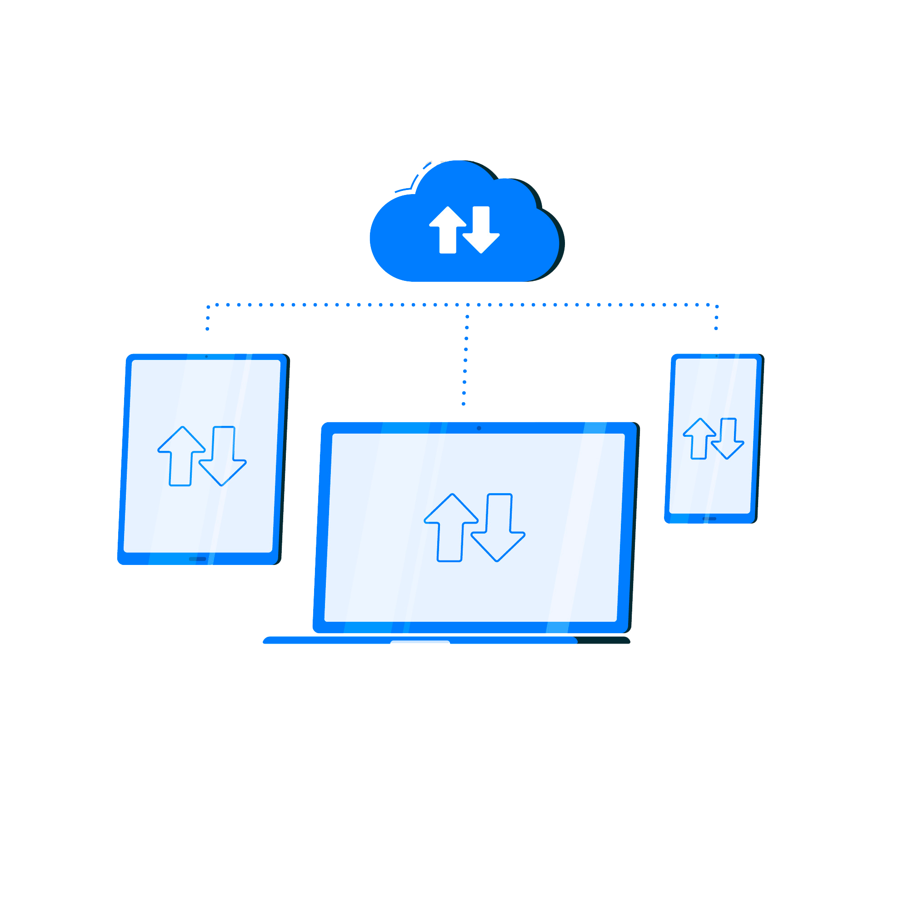

<!-- PROJECT LOGO -->
 

  

<h2 align="center">"ClientServerSharedMemory"</h2>

  

    Проект состоящий из двух программ, которые взаимодействуют с помощью сокетов

  

### <a name="Использованные-библиотеки">Использованные библиотеки</a>
При разработке даных программ использовались возможности стандартной библиотеки языка С++

### <a name="Сборка">Сборка приложения</a>
Сборка и проверка функционирования приложения производилась под управлением операционной системы Ubuntu 22.04.
Проверена сборка на:

* Visual Studio Code
* GCC 11.3.0x86_64-linux-gnu
* Cmake Version 3.22.1

Запуск приложения из командной строки

В начале запускаем server 

  	        mkdir build
  	        cd build
  	        cmake ..
  	        cmake --build . --config Release --target server
                ./server
Server ждёт информации от программы №1		
После чего можно запустить prog1 (в другом терминале)

                mkdir build
  	        cd build
  	        cmake ..
  	        cmake --build . --config Release --target prog1
                ./prog1
		
 Далее программа ждёт ввода чисел, не более 64-х или символ # для завершении программ.(Завершаются обе программы program1 и server).
При вводе более 64-х символов лишние символы отбрасываются.
Программа prog1 состоит из трёх потоков: main th1 и th2. Потоки th1 и th2 синхронизированы между собой с помощью изменения условной переменной, реализованной классом condition_variable. Т.е. поток th1 принимает корректную информацию (string из не более 64-х цыфр). После строка сортируется по убыванию и все четные элементы заменяются на латинские буквы «КВ». После данная строка помещается в общий буфер и поток ожидает  дальнейшего ввода пользователя(oбщим буфером у нас является shared memory). 
   После того как буфер получил std::string data, условная переменная меняется и даёт возможность поработать потоку th2. Поток th2 выводит в консоль полученные данные а область памяти буфера удаляется.
   Далее поток складывает все цифры строки и отправляет полученную сумму программе server.
   server получает сумму и проверяет на колличество символов(не менее двух) и на кратность 32-м. Если корректная информация выводит в консоль: Data received в противном случаи: Data error
Взаимодействие програм цеклично пока программа prog1 не получит символ #
